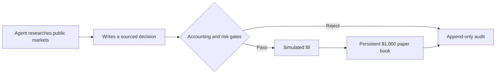

<div align="center">

# EDGECRAFT

### An autonomous paper fund that starts with $1,000 of fake money

Edgecraft is a trading experiment, not a brokerage product. Several times a weekday an AI agent researches public markets, writes a short-term thesis, and proposes a portfolio change. Deterministic Python either accepts that proposal or rejects it. Accepted trades are **simulated fills** in an append-only ledger. There is no live mode, no broker adapter, and no path that can touch real money.

[](https://github.com/Amadeus415/agentic_trading/actions/workflows/ci.yml)
[](pyproject.toml)
[](LICENSE)
[](docs/CODEX_SCHEDULED_TASK.md)

**[Starting prompt](docs/FUND_STARTING_PROMPT.md)** · **[Scheduled task](docs/CODEX_SCHEDULED_TASK.md)** · **[Accounting contract](docs/FUND_ACCOUNTING.md)** · **[Dashboard](#dashboard)**

</div>


The chart is regenerated from the verified ledger after every scheduled cycle. The solid line is **fund value** (NAV: cash plus marked positions). The dashed line is the original **$1,000**. It is a public snapshot of this experiment, not a brokerage statement or a claim of skill.

> [!IMPORTANT]
> Edgecraft cannot place a real order. Models may propose; typed policy and accounting code authorize. The agent cannot inject cash, reset losses, edit history, or bypass the risk envelope.

## How one cycle works



1. **Research.** Codex reads the ledger's memory, searches public sources, and writes one packet for the current UTC session: trade or hold, with quotes, evidence, and a falsifiable 4–72 hour thesis.
2. **Authorize.** `paper_fund.py` checks cash, inventory, concentration, exposure, fees, freshness, and idempotency. A rejected packet changes nothing.
3. **Record.** Accepted trades become simulated fills. Every decision, quote, fill, and rejection is hash-chained in SQLite and cannot be edited or deleted.

In one sentence: the agent proposes a sourced portfolio decision; typed code applies it to a persistent fake-money book.

## The experiment

The bankroll is deposited **once**. There is no daily top-up and no reset after losses. The research objective is to compound $1,000 into $100,000 over ten years — about 58.5% annualized as a target, not a promise.

The live book is `edgecraft-aggressive` (`examples/fund.mandate.aggressive.json`). It is a high-tempo 4–72 hour trader:

- long or short stocks, native crypto, and binary prediction contracts
- any syntactically valid instrument; there is no symbol whitelist
- several independent high-conviction positions when they exist, not a pile of weak ones
- scheduled cycles may not sit in 100% cash

Every order still needs a fresh sourced price, cited evidence, valid inventory, and room inside the envelope below. The original conservative book stays frozen at `state/edgecraft-fund.db`.

| Control | Limit |
|:--|--:|
| Initial fake cash | $1,000 once |
| Gross exposure | max($1,500, 3.00 × earned NAV) |
| Absolute net exposure | max($1,000, 2.00 × earned NAV) |
| Short exposure | max($500, 1.00 × earned NAV) |
| One position | 60% of NAV |
| Turnover per cycle | max($1,000, 4.00 × earned NAV) |
| Orders per cycle | 30 |
| Drawdown gate | 50% |
| Simulated fee / slippage | 5 / 10 bps |

Dollar values are bootstrap floors. Limits scale only after the fund *earns* a higher NAV, never through deposits.

## Run it

Needs Python 3.11–3.14 and [uv](https://docs.astral.sh/uv/).

```bash
make install
make validate
make fund-init
make fund-context
```

`fund-context` is what the agent reads before it decides: cash, positions, P&L, mandate, JSON schema, and a compact ledger-derived **brain** (recent theses, later NAV direction, costs, winning/losing exits, current unrealized P&L). The brain is feedback, not proof that the last trade caused the next NAV move.

To exercise all three asset classes with static example data and a disposable ledger:

```bash
tmp_ledger="$(mktemp -d)/edgecraft-example.db"
uv run edgecraft fund-init \
  --config examples/fund.mandate.json \
  --ledger "$tmp_ledger"
uv run edgecraft fund-run \
  --config examples/fund.mandate.json \
  --input examples/fund-cycle.starting.example.json \
  --ledger "$tmp_ledger"
uv run edgecraft fund-verify \
  --config examples/fund.mandate.json \
  --ledger "$tmp_ledger"
```

That example is fixture data, not a current market decision.

## Operate the scheduled book

The first run uses the [starting prompt](docs/FUND_STARTING_PROMPT.md): empty $1,000 book, researched opening trade required. Later runs use the [scheduled task](docs/CODEX_SCHEDULED_TASK.md): mark every open position, revisit the thesis, then trade or hold without a human approval step. A scheduled hold is legal only while positions are still open.

```bash
uv run edgecraft fund-cycle-key
# prints: state/fund-inputs/YYYY-MM-DD-session-us-open.json
./scripts/run_scheduled_cycle.sh
```

The script refuses a missing or stale packet, verifies the hash chain, applies one fake-money cycle, and verifies the full history again. It contains no broker command.

```bash
make fund-show      # current book; includes --history
make fund-verify    # hash chain + accounting replay
```

CLI defaults are the aggressive mandate and `state/edgecraft-aggressive.db`. Pass `--config` / `--ledger` only to inspect another book.

| Command | Job |
|:--|:--|
| `fund-validate` | Parse the checked-in mandate |
| `fund-init` | Capitalize the fund exactly once |
| `fund-context` | Agent packet: state, brain, JSON schema |
| `fund-run` | Apply one researched decision |
| `fund-show` | Inspect the book |
| `fund-cycle` | One cycle packet (`--audit` for event gaps) |
| `fund-verify` | Hash-chain and accounting replay |
| `fund-visualize` | Rebuild the README chart from the ledger |

## Dashboard

Read-only Next.js UI for fund value, positions, journals, hypotheses, the fund brain, and paper fills over `state/edgecraft-aggressive.db`.

```bash
make dashboard
```

See [dashboard/README.md](dashboard/README.md).

## Accounting model

- Positions have signed fractional quantities: positive is long, negative is short.
- `buy` cannot cover, `sell` cannot open a short, `short` cannot reduce a long, and `cover` cannot open a long.
- NAV is cash plus signed marked positions. Gross exposure uses absolute market values.
- Fees and adverse slippage are charged on every simulated fill.
- Prediction contracts settle only from a sourced terminal quote of exactly `0` or `1`.
- A cycle is atomic. A rejected input changes nothing.
- Replaying the same cycle and payload is a no-op; changing a used cycle key is rejected.
- The exact normalized decision, evidence, quotes, fills, state, and chained events are stored in SQLite. Immutable-table triggers reject update and delete.

See [the accounting contract](docs/FUND_ACCOUNTING.md) for formulas, the decision packet, and invariants.

## Repository map

```text
src/edgecraft/
├── paper_fund.py           # typed models, accounting, risk, SQLite audit ledger
├── fund_brain.py           # compact outcomes, position hypotheses, and lessons
├── fund_visualization.py   # GitHub-safe SVG of verified fund value
├── schedule.py             # UTC session slots and cycle keys
├── cli.py                  # fund commands plus optional research-lab commands
├── growth.py               # deterministic growth objective and capital stages
└── observability.py        # structured JSON logging

examples/fund.mandate.aggressive.json       # active $1,000 aggressive mandate
examples/fund.mandate.json                  # retired conservative fixture
examples/fund-cycle.starting.example.json   # executable three-market fixture
scripts/run_scheduled_cycle.sh              # fixed session paper apply path
scripts/deny_broker_tools.py                # fail-closed fence against broker tools
tests/test_paper_fund.py                    # accounting and failure invariants
docs/                                       # accounting contract and agent prompts
```

## Research lab

Causal backtest, strategy, and walk-forward tools live in the optional `lab` extra. They are research inputs, not the paper fund's source of cash or execution authority.

```bash
uv sync --extra lab   # or: make install, which includes the lab via --extra dev
make demo
make validate-lab
uv run edgecraft strategies
uv run edgecraft backtest --config examples/research.json --data-source synthetic
uv run edgecraft walk-forward \
  --config examples/research.json \
  --data-source synthetic \
  --train-sessions 504 \
  --test-sessions 126
```

Options are out of scope until the domain has explicit contracts for multipliers, expiry, exercise/assignment, spreads, liquidity, and worst-case loss. Edgecraft will not pretend an option is ordinary stock.

## Security and privacy

Generated ledgers, inputs, caches, and logs stay out of Git. Never include credentials, private account data, or unnecessary personal information in evidence packets. Use public URLs and concise provenance. Report vulnerabilities through [SECURITY.md](SECURITY.md).

Edgecraft is released under the [Apache License 2.0](LICENSE).
