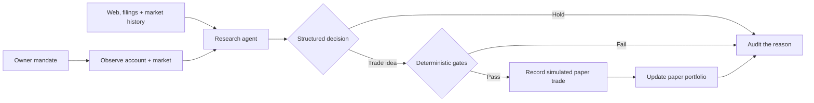

<div align="center">

# EDGECRAFT

### An autonomous daily paper-trading system with a flight recorder

Researches the market. Forms a thesis. Tests the downside. Records only simulated paper trades. Never places a real order from the scheduled task.

[](https://github.com/Amadeus415/agentic_trading/actions/workflows/ci.yml)
[](pyproject.toml)
[](LICENSE)
[](docs/AUTONOMY.md)

**[How it works](docs/HOW_EDGECRAFT_WORKS.md)** · **[Autonomy runbook](docs/AUTONOMY.md)** · **[Scheduled Codex task](docs/CODEX_SCHEDULED_TASK.md)** · **[Decision data](docs/DECISION_DATA_MODEL.md)** · **[Performance](docs/PERFORMANCE_EVALUATION.md)** · **[Security](SECURITY.md)**

</div>

> [!IMPORTANT]
> Edgecraft is an engineering and research project, not investment advice. Backtests are estimates, live markets are adversarial, and no software can promise a return.

## The fund in one screen

| Layer | What is allowed to be smart | What must stay deterministic |
|:--|:--|:--|
| **Research** | Search current context, compare opportunities, form hypotheses | Point-in-time data, causal fills, cost assumptions, promotion evidence |
| **Decision** | Rank alternatives and choose invest or hold | Typed schema, fixed universe, budget ceiling, idempotent cycle |
| **Risk** | Explain tradeoffs | Cash, concentration, liquidity, spread, drawdown, turnover, freshness, market-hours gates |
| **Execution** | Build a simulated allocation | Fixed shadow mode, paper prices, no broker mutation |
| **Proof** | Summarize the outcome | Append-only paper events and cash-flow-matched evaluation books |

The governing rule is simple:

> **The model proposes. Typed policy authorizes. The paper portfolio simulates. The ledger proves.**



## What is real today

- Causal backtests: a signal at session close cannot receive a same-close fantasy fill.
- Walk-forward evaluation, cost stress, block-bootstrap intervals, Deflated Sharpe Ratio, and PBO/CSCV overfitting checks.
- A typed mandate that scopes capital, cadence, symbols, benchmark, strategy tilt, and live authority.
- Completed-session intelligence across the full universe, focused web/SEC/social research for ranked candidates, and final fresh broker reads for selected symbols.
- A market-weekday autonomous loop powered by Codex, with deterministic paper-trade approval outside the model.
- A `$25` daily simulated portfolio contribution, with explicit `paper_trade_recorded` audit events and no broker mutation.
- A second read-only broker preflight, a policy-fingerprint re-check, exact Robinhood input mapping, and an expiring single-use permit before placement.
- A kill switch, overlap lock, attempt-scoped order IDs, bounded side-effect-free retries, unresolved-order blocking, and post-order reconciliation.
- An append-only SQLite audit ledger, structured logs, metrics, and CLI health/readiness checks.
- Cash-flow-matched agent, SPY benchmark, and strategic-baseline books for honest performance comparison.

Want the mental model rather than the feature list? **[Walk through the codebase and one complete trade →](docs/HOW_EDGECRAFT_WORKS.md)**

## Run Edgecraft locally

Requirements: Python 3.11–3.14 and [uv](https://docs.astral.sh/uv/).

```bash
make install
make validate
make demo
```

Useful operator checks (CLI is the control surface):

```bash
uv run edgecraft health
uv run edgecraft autonomy-health --ledger state/edgecraft-paper.db
uv run edgecraft readiness \
  --mandate examples/mandate.index-dca.json \
  --ledger state/edgecraft-paper.db
uv run edgecraft runs --ledger state/edgecraft-paper.db --limit 10
uv run edgecraft metrics --ledger state/edgecraft-paper.db
```

Scheduled unattended wake (paper-only, fail-closed):

```bash
./scripts/run_scheduled_cycle.sh
# or: make scheduled-cycle
```

`health` and unsuccessful `cycle` results exit nonzero. Codex should run only that script. The script fixes the mandate to the checked-in daily shadow configuration and does not accept a live-mandate override. Approved proposals update simulated evaluation books and an explicit paper-trade audit event; they do not create broker `placed` or `filled` events. For the Codex prompt, use the [scheduled Codex task guide](docs/CODEX_SCHEDULED_TASK.md).

## Repository map

```text
src/edgecraft/
├── autonomous_service.py   # the end-to-end state machine
├── codex_runtime.py        # structured reasoning and Robinhood MCP handoff
├── autonomy.py             # mandate cadence, budget, and proposal assembly
├── risk.py                 # deterministic policy and risk gates
├── ledger.py               # idempotency, permits, events, reconciliation trail
├── engine.py               # causal backtest execution
├── research.py             # experiment matrix and robustness evidence
├── evaluation.py           # agent vs benchmark vs strategic baseline
├── decision_memory.py      # bounded prior-thesis and benchmark feedback
└── cli.py                  # the operational entrypoint

examples/                   # synthetic and shadow-first configurations
tests/                      # math, policy, integration, and failure paths
docs/                       # concepts, operations, data contracts, and security
scripts/                    # trade guard and operational helpers
```

## Safety boundary

Edgecraft does not store Robinhood credentials. Ledgers, caches, logs, mandates, and generated account artifacts stay out of Git. Live execution must be explicitly armed for one account and mandate, and the reasoning agent cannot bypass the hard policy gates.

Never commit account exports, OAuth material, tax records, raw broker responses, or screenshots with personal information. Report vulnerabilities through [SECURITY.md](SECURITY.md).

## Explore further

| Guide | Use it when you want to… |
|:--|:--|
| [How Edgecraft works](docs/HOW_EDGECRAFT_WORKS.md) | Build a mental model, follow the code, and trace a trade step by step |
| [Autonomous operations](docs/AUTONOMY.md) | Configure shadow/live mandates, scheduling, monitoring, and incidents |
| [Scheduled Codex task](docs/CODEX_SCHEDULED_TASK.md) | Run the fail-closed daily autonomy wake path |
| [Decision data model](docs/DECISION_DATA_MODEL.md) | See what evidence and reasoning are retained for every decision |
| [Performance evaluation](docs/PERFORMANCE_EVALUATION.md) | Compare the agent with SPY and the strategic baseline fairly |
| [External context](docs/EXTERNAL_CONTEXT.md) | Configure current web, SEC, and social inputs |

Contributions are welcome; start with [CONTRIBUTING.md](CONTRIBUTING.md). Edgecraft is released under the [Apache License 2.0](LICENSE).
