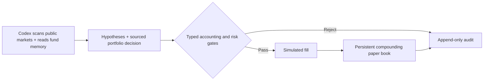

<div align="center">

# EDGECRAFT

### An autonomous paper fund pursuing $1,000 → $100,000

Edgecraft is a fully autonomous paper-trading fund with one job: turn $1,000 of fake money into $100,000 without ever touching a real brokerage account. Every day an AI agent (Codex) scans public markets, manages a multi-position stock/crypto/prediction book, and records falsifiable hypotheses before proposing a buy, sell, short, cover, or hold. Deterministic Python decides whether that proposal is allowed. Accepted trades land in an append-only SQLite ledger with the full evidence and decision journal; rejected ones are recorded too, and nothing can be edited or deleted afterward.

The design principle is simple: **models may propose; typed policy and risk engines authorize.** The agent cannot bypass accounting checks, inject cash, reset losses, or place a real order — the codebase has no live execution path at all.

[](https://github.com/Amadeus415/agentic_trading/actions/workflows/ci.yml)
[](pyproject.toml)
[](LICENSE)
[](docs/CODEX_SCHEDULED_TASK.md)

**[Interactive 3D explainer](docs/how-edgecraft-works-3d.html)** · **[Starting prompt](docs/FUND_STARTING_PROMPT.md)** · **[Daily Codex task](docs/CODEX_SCHEDULED_TASK.md)** · **[Accounting contract](docs/FUND_ACCOUNTING.md)** · **[Research lab](#research-lab)**

</div>

> [!IMPORTANT]
> Edgecraft is an engineering experiment, not investment advice. The active fund is incapable of placing a real order: it has no live mode, broker adapter, credentials, or execution permit.

## The whole system



The bankroll is deposited once. There is no daily contribution and no reset. The explicit research objective is to compound $1,000 into $100,000 over ten years—an aggressive 100x target requiring about 58.5% annualized returns, not a promise. The fund can hold cash or take long and short positions in stocks, native crypto, and binary prediction contracts. It may name any syntactically valid instrument; there is no symbol whitelist. Every trade still needs fresh sourced prices, cited evidence, valid inventory, and room inside the checked-in risk envelope.

The active book is the aggressive mandate (`edgecraft-aggressive` in `examples/fund.mandate.aggressive.json`): a high-tempo, short-term trader that searches for opportunities every cycle, manages several independent positions when strong ideas exist, can run full-size shorts, and cuts broken theses fast. Activity is not the objective; compounded NAV is. The original conservative book (`edgecraft-1k`) stays frozen and verifiable at `state/edgecraft-fund.db`.

Current envelope:

| Control | Limit |
|:--|--:|
| Initial fake cash | $1,000 once |
| Gross exposure | max($1,500, 3.00 × earned NAV) |
| Absolute net exposure | max($1,000, 2.00 × earned NAV) |
| Short exposure | max($500, 1.00 × earned NAV) |
| One position | 60% of NAV |
| Turnover per cycle | max($1,000, 4.00 × earned NAV) |
| Orders per cycle | 30 |
| Drawdown gate | 50% |
| Simulated fee / slippage | 5 / 10 bps |

The dollar values are bootstrap floors; limits scale only after the fund earns a higher NAV, never through deposits. Codex chooses the instruments, direction, sizing, and whether to trade; code prevents broken accounting, stale or unsupported inputs, and risk outside the experiment. The growth target cannot override those controls.

## Run it

Requirements: Python 3.11–3.14 and [uv](https://docs.astral.sh/uv/).

```bash
make install
make validate
make fund-init
make fund-context
```

`fund-context` prints the authoritative cash, positions, P&L, target progress, capital stage, mandate, exact JSON schema, and a compact ledger-derived brain. The brain shows recent theses, later NAV direction, costs, winning/losing exits, current unrealized P&L, rejections, and the latest hypothesis for each instrument. It is feedback, not causal performance attribution.

To exercise all three asset classes with static example data and a disposable ledger:

```bash
tmp_ledger="$(mktemp -d)/edgecraft-example.db"
uv run edgecraft fund-init \
  --config examples/fund.mandate.json \
  --ledger "$tmp_ledger"
uv run edgecraft fund-run \
  --config examples/fund.mandate.json \
  --input examples/fund-cycle.starting.example.json \
  --ledger "$tmp_ledger"
uv run edgecraft fund-verify \
  --config examples/fund.mandate.json \
  --ledger "$tmp_ledger"
```

The example is executable fixture data, not a current market decision.

## Start and operate the real paper book

The first run uses the [starting prompt](docs/FUND_STARTING_PROMPT.md). It gives Codex the empty $1,000 book and lets it decide how much to deploy, where, and in which direction. Later runs use the [daily task](docs/CODEX_SCHEDULED_TASK.md) to mark every open position, revisit the thesis, and trade or hold without human approval.

Codex writes the complete researched packet to:

```text
state/fund-inputs/YYYY-MM-DD.json
```

Then the fixed apply path runs:

```bash
./scripts/run_scheduled_cycle.sh
```

The script refuses a missing or non-current input, verifies the existing hash chain before applying anything, runs the deterministic paper cycle, and verifies the entire accounting history again. It contains no broker command.

Inspect the experiment at any time:

```bash
make fund-status
make fund-brain
make fund-performance
uv run edgecraft fund-events \
  --config examples/fund.mandate.json \
  --ledger state/edgecraft-fund.db \
  --limit 20
uv run edgecraft fund-verify \
  --config examples/fund.mandate.json \
  --ledger state/edgecraft-fund.db
```

## Dashboard

Read-only Next.js UI for NAV, positions, cycles, and paper fills over `state/edgecraft-fund.db`.

```bash
cd dashboard && npm install && npm run dev
# or: make dashboard
```

Set `EDGECRAFT_FUND_DB=../state/edgecraft-fund.db` in `dashboard/.env.local` (default). See [dashboard/README.md](dashboard/README.md).

## Accounting model

- Positions have signed fractional quantities: positive is long, negative is short.
- `buy` cannot cover, `sell` cannot open a short, `short` cannot reduce a long, and `cover` cannot open a long.
- NAV is cash plus signed marked positions. Gross exposure uses absolute market values.
- Fees and adverse slippage are charged on every simulated fill.
- Prediction contracts settle only from a sourced terminal quote of exactly `0` or `1`.
- A cycle is atomic. A rejected input changes nothing.
- Replaying the same cycle and payload is a no-op; changing a used cycle key is rejected.
- The exact normalized decision, evidence, quotes, fills, state, request digest, and chained events are stored in SQLite. Immutable-table triggers reject update and delete operations.

See [the accounting contract](docs/FUND_ACCOUNTING.md) for formulas and schemas.

## Repository map

```text
src/edgecraft/
├── paper_fund.py           # typed models, accounting, risk, SQLite audit ledger
├── fund_brain.py           # compact outcomes, position hypotheses, and lessons
├── cli.py                  # fund commands plus the preserved research CLI
├── context.py              # sourced web/market evidence with freshness policy
├── codex_runtime.py        # invocation harness for the scheduled Codex agent
├── decision_memory.py      # legacy contribution-orchestrator memory
├── growth.py               # deterministic growth objective and capital stages
├── observability.py        # structured JSON logging and event emission
├── engine.py               # causal backtest execution
├── research.py             # experiment matrix and robustness evidence
└── walkforward.py          # out-of-sample strategy validation

examples/fund.mandate.aggressive.json       # active $1,000 aggressive mandate
examples/fund.mandate.json                  # retired conservative mandate
examples/fund-cycle.starting.example.json   # executable three-market fixture
scripts/run_scheduled_cycle.sh              # fixed daily paper apply path
tests/test_paper_fund.py                    # accounting and failure invariants
docs/                                       # accounting contract, prompts, autonomy notes
```

## Research lab

The earlier causal backtest, strategy, cost-stress, and walk-forward tools remain available and tested. They are research inputs, not the paper fund's source of cash or execution authority.

```bash
make demo
uv run edgecraft strategies
uv run edgecraft backtest --config examples/research.json --data-source synthetic
uv run edgecraft walk-forward \
  --config examples/research.json \
  --data-source synthetic \
  --train-sessions 504 \
  --test-sessions 126
```

Historical contribution-based autonomy modules remain for backward compatibility, but the checked-in schedule and active product path use the `paper_fund.py` accounting core, `fund_brain.py` read model, and fake-money ledger.

Options are intentionally not modeled yet. Adding them requires explicit
contracts for multipliers, expiry, exercise/assignment, spreads, liquidity, and
worst-case loss; Edgecraft will not pretend an option is ordinary stock.

## Security and privacy

Generated ledgers, inputs, caches, and logs stay out of Git. Never include credentials, private account data, form contents, or unnecessary personal information in evidence packets. Use public URLs and concise provenance. Report vulnerabilities through [SECURITY.md](SECURITY.md).

Edgecraft is released under the [Apache License 2.0](LICENSE).
