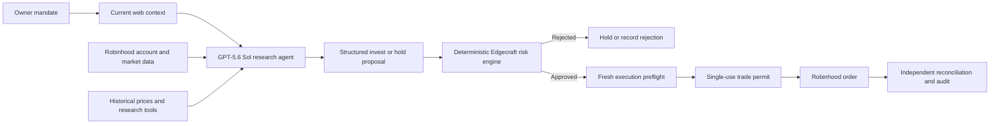

# Edgecraft

I’m building Edgecraft to explore a simple question: can an agent make small,
repeatable stock-market decisions without being given unlimited control?

The project can research and backtest strategies, observe a portfolio, propose a
weekly trade, and keep a record of what happened. The model handles judgment;
ordinary Python code enforces the budget, allowed symbols, data freshness, and
other hard limits. New setups run in shadow mode, so they do not place real
orders.

This is an experiment, not investment advice. Backtests can be wrong, market
data can be incomplete, and none of this promises a return.

## What works today

- Point-in-time backtests with next-session execution and realistic costs
- Walk-forward tests, Deflated Sharpe Ratio, and backtest-overfitting checks
- A typed weekly investing mandate and deterministic risk policy
- A local dashboard, CLI, and append-only audit ledger
- Audited Browserbase web search plus SEC and public Bluesky context
- Shadow trading and an explicitly armed, tightly limited Robinhood path
- A kill switch, expiring single-use trade permits, and broker reconciliation
- A second, read-only execution preflight before any permit exists
- Market-session, spread, liquidity, rolling-turnover, and drawdown gates
- A completed-session market-intelligence snapshot for the full approved universe
- Cash-flow-matched agent, SPY, and deterministic strategic evaluation books

The safest mental model is that the model proposes, but ordinary code controls
whether anything can reach the broker:



## Try it locally

You’ll need Python 3.11–3.14, [uv](https://docs.astral.sh/uv/), and Node for one
JavaScript syntax check. Autonomous web context also needs a free
[Browserbase](https://www.browserbase.com/) project key.

```bash
make install
make validate
make dev
```

Then open [http://127.0.0.1:8000](http://127.0.0.1:8000).

For a terminal-only demo:

```bash
make demo
```

The checked-in mandate is shadow-only. Do not turn on live trading until you
have read [the autonomy guide](docs/AUTONOMY.md), reviewed every limit, and run
enough shadow cycles to understand the failure modes.

See [the external-context guide](docs/EXTERNAL_CONTEXT.md) to configure and test
current web, filing, and social inputs without placing an order.

See [the performance guide](docs/PERFORMANCE_EVALUATION.md) for the daily SPY
benchmark, strategic baseline, and point-in-time market snapshot.

See [the production-readiness review](docs/PRODUCTION_READINESS.md) for the
architecture benchmark and [the Codex scheduled-task guide](docs/CODEX_SCHEDULED_TASK.md)
for unattended operation.

## Privacy and security

Edgecraft does not store Robinhood credentials. Local state, logs, caches, and
generated artifacts are ignored by Git, and broker-derived state is written
with private file permissions. The operator API binds to `127.0.0.1`; it is not
designed to be exposed directly to the internet.

Never commit account exports, OAuth material, raw broker responses, tax data,
or screenshots containing personal information. If you want to publish your
trades or performance, start with the checklist in
[docs/OPEN_SOURCE.md](docs/OPEN_SOURCE.md).

Please report vulnerabilities using [SECURITY.md](SECURITY.md). Security work
is ongoing: the safeguards reduce risk, but no trading software should be
treated as perfectly secure.

## Project map

- `src/edgecraft/` — research, policy, execution, audit, and CLI code
- `frontend/` — local operator dashboard
- `examples/` — synthetic and placeholder-only configurations
- `tests/` — unit, integration, dry-run, and failure-path tests
- `docs/AUTONOMY.md` — operating model and live-trading boundary
- `docs/EXTERNAL_CONTEXT.md` — Browserbase and public-context data contract
- `docs/ORCHESTRATOR.md` — lower-level Robinhood MCP handoff

Contributions are welcome. Start with [CONTRIBUTING.md](CONTRIBUTING.md).

## License

Edgecraft is available under the [Apache License 2.0](LICENSE). You may use,
modify, and share it under that license. Third-party packages keep their own
licenses.
