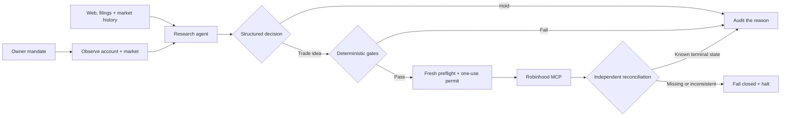
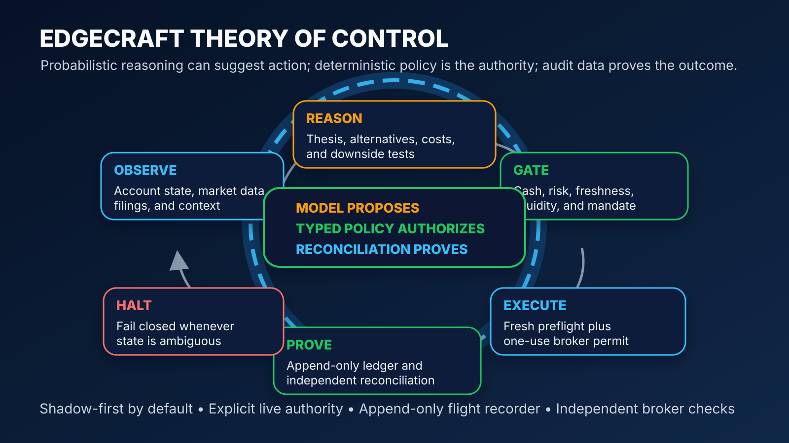

<div align="center">

# EDGECRAFT

### An autonomous, policy-gated trading system with a flight recorder

Researches the market. Forms a thesis. Tests the downside. Places only permitted trades. Then independently checks what the broker actually did.

[](https://github.com/Amadeus415/agentic_trading/actions/workflows/ci.yml)
[](pyproject.toml)
[](LICENSE)
[](docs/AUTONOMY.md)

**[Fund thesis](docs/FIRST_PRINCIPLES_FUND.md)** · **[How it works](docs/HOW_EDGECRAFT_WORKS.md)** · **[Autonomy runbook](docs/AUTONOMY.md)** · **[Decision data](docs/DECISION_DATA_MODEL.md)** · **[Performance](docs/PERFORMANCE_EVALUATION.md)** · **[Security](SECURITY.md)**

</div>

> [!IMPORTANT]
> Edgecraft is an engineering and research project, not investment advice. Backtests are estimates, live markets are adversarial, and no software can promise a return.

## The fund in one screen

| Layer | What is allowed to be smart | What must stay deterministic |
|:--|:--|:--|
| **Research** | Search current context, compare opportunities, form hypotheses | Point-in-time data, causal fills, cost assumptions, promotion evidence |
| **Decision** | Rank alternatives and choose invest or hold | Typed schema, fixed universe, budget ceiling, idempotent cycle |
| **Risk** | Explain tradeoffs | Cash, concentration, liquidity, spread, drawdown, turnover, freshness, market-hours gates |
| **Execution** | Prepare a broker review and recover from ambiguity | Policy fingerprint, preflight, expiring one-use permit, kill switch |
| **Proof** | Summarize the outcome | Append-only events and independent broker reconciliation |

The governing rule is simple:

> **The model proposes. Typed policy authorizes. The broker executes. Reconciliation proves.**



## What is real today

- Causal backtests: a signal at session close cannot receive a same-close fantasy fill.
- Walk-forward evaluation, cost stress, block-bootstrap intervals, Deflated Sharpe Ratio, and PBO/CSCV overfitting checks.
- A typed mandate that scopes capital, cadence, symbols, benchmark, strategy tilt, and live authority.
- Completed-session intelligence across the full universe, focused web/SEC/social research for ranked candidates, and final fresh broker reads for selected symbols.
- A market-day autonomous loop powered by Codex, with deterministic trade approval outside the model.
- Shadow and explicitly armed live paths; new examples remain shadow-first.
- A second read-only broker preflight, a policy-fingerprint re-check, exact Robinhood input mapping, and an expiring single-use permit before placement.
- A kill switch, overlap lock, attempt-scoped order IDs, bounded side-effect-free retries, unresolved-order blocking, and post-order reconciliation.
- An append-only SQLite audit ledger, structured logs, metrics, health/readiness checks, and a local operator dashboard.
- Cash-flow-matched agent, SPY benchmark, and strategic-baseline books for honest performance comparison.

## Interactive operator dashboard

[](http://127.0.0.1:8000/)

The colorful preview uses synthetic values; the running dashboard reads your local audit ledger. It gives you an interactive overview of portfolio state, autonomy health, agent runs, policy decisions, and recent broker orders without exposing credentials or account identifiers.

After `make dev`, **[open the dashboard](http://127.0.0.1:8000/)** or jump directly to **[recent trades](http://127.0.0.1:8000/#/trades)**. Select an order to inspect its reasoning, evidence, policy result, broker events, and reconciliation status.

<!-- edgecraft-console:start -->
### Daily operations snapshot

> **READY** · aggregate ledger snapshot for **2026-07-22 UTC**<br>
> Control-plane warnings: **0**. Details remain in the private ledger.

| Control | Current reading |
|:--|:--|
| Mandate mode | `live` |
| Latest cycle | `HELD` · 2026-07-22 18:33 UTC |
| Last successful cycle | 2026-07-22 18:33 UTC |
| Kill switch | `INACTIVE` |
| Unresolved broker orders | `0` |

| Audited lifecycle | Count | What it means |
|:--|--:|:--|
| Autonomous cycles | **3** | Idempotent runs persisted |
| Approved proposals | **3** | Passed deterministic review gates |
| Held / rejected proposals | **5** | Cash preserved or policy blocked action |
| Orders placed | **1** | Broker placement events recorded |
| Fills recorded | **1** | Filled lifecycle events recorded |

<sub>Generated from privacy-safe aggregate ledger fields. Account identifiers, symbols, positions, order sizes, broker payloads, credentials, and model prompts are never written here. A test, proposal, or permit is not counted as a fill.</sub>
<!-- edgecraft-console:end -->

Want the mental model rather than the feature list? **[Walk through the codebase and one complete trade →](docs/HOW_EDGECRAFT_WORKS.md)**

## Run Edgecraft locally

Requirements: Python 3.11–3.14, [uv](https://docs.astral.sh/uv/), and Node.js for the frontend syntax check.

```bash
make install
make validate
make dev
```

Open [http://127.0.0.1:8000](http://127.0.0.1:8000). For a terminal-only synthetic demo, run:

```bash
make demo
```

Useful operator checks:

```bash
uv run edgecraft health
uv run edgecraft autonomy-health --ledger state/edgecraft.db
uv run edgecraft readiness \
  --mandate examples/mandate.index-dca.json \
  --ledger state/edgecraft.db
uv run edgecraft runs --ledger state/edgecraft.db --limit 10
```

The checked-in mandate is shadow-only. Read the [autonomy runbook](docs/AUTONOMY.md) before creating a separately versioned live mandate.

## Repository map

```text
src/edgecraft/
├── autonomous_service.py   # the end-to-end state machine
├── codex_runtime.py        # structured reasoning and Robinhood MCP handoff
├── autonomy.py             # mandate cadence, budget, and proposal assembly
├── risk.py                 # deterministic policy and risk gates
├── ledger.py               # idempotency, permits, events, reconciliation trail
├── engine.py               # causal backtest execution
├── research.py             # experiment matrix and robustness evidence
├── evaluation.py           # agent vs benchmark vs strategic baseline
├── decision_memory.py      # bounded prior-thesis and benchmark feedback
└── cli.py                  # the operational entrypoint

frontend/                   # dependency-free local control plane
examples/                   # synthetic and shadow-first configurations
tests/                      # math, policy, integration, and failure paths
docs/                       # concepts, operations, data contracts, and security
```

## Safety boundary

Edgecraft does not store Robinhood credentials. The local API binds to `127.0.0.1`; ledgers, caches, logs, mandates, and generated account artifacts stay out of Git. Live execution must be explicitly armed for one account and mandate, and the reasoning agent cannot bypass the hard policy gates.

Never commit account exports, OAuth material, tax records, raw broker responses, or screenshots with personal information. Start with the [open-source checklist](docs/OPEN_SOURCE.md) and report vulnerabilities through [SECURITY.md](SECURITY.md).

## Explore further

| Guide | Use it when you want to… |
|:--|:--|
| [First-principles fund thesis](docs/FIRST_PRINCIPLES_FUND.md) | See which real-world investment lessons transfer, the evidence hierarchy, and the build order |
| [How Edgecraft works](docs/HOW_EDGECRAFT_WORKS.md) | Build a mental model, follow the code, and trace a trade step by step |
| [Autonomous operations](docs/AUTONOMY.md) | Configure shadow/live mandates, scheduling, monitoring, and incidents |
| [Decision data model](docs/DECISION_DATA_MODEL.md) | See what evidence and reasoning are retained for every decision |
| [Performance evaluation](docs/PERFORMANCE_EVALUATION.md) | Compare the agent with SPY and the strategic baseline fairly |
| [Production readiness](docs/PRODUCTION_READINESS.md) | Review controls, gaps, and the path toward dependable operation |
| [External context](docs/EXTERNAL_CONTEXT.md) | Configure current web, SEC, and social inputs |

Contributions are welcome; start with [CONTRIBUTING.md](CONTRIBUTING.md). Edgecraft is released under the [Apache License 2.0](LICENSE).
