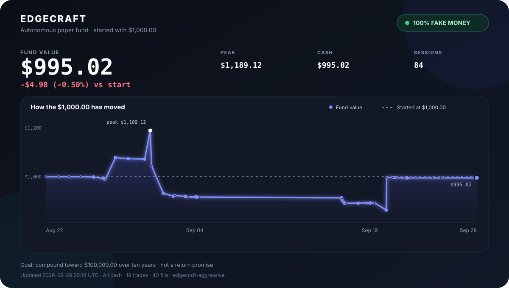

# Edgecraft

**Can an autonomous fund powered by a Codex subscription beat the S&P 500?**

That's the experiment. Edgecraft starts with $1,000 of simulated money, researches public markets, takes short-term positions, and learns from the results. The ambition is aggressive growth: find opportunities often, act quickly, and improve the process over time.

All trades are paper trades. There is no real-money execution path.

## How it works

Three loops run one fund:

1. **Trade.** Codex researches stocks, crypto, and prediction markets. It explains each idea, estimates its probability, and gives it a target, a stop, and a 4–72 hour horizon. Python fetches prices, sizes positions, checks limits, and records simulated fills.
2. **Manage.** A Python monitor configured for five-minute checks checks existing positions and enforces exits. It needs no model call.
3. **Learn.** Daily or after 10 completed positions, Codex reviews outcomes and proposes changes. New versions get a forward paper budget immediately and keep separate records. Recent winners earn larger budgets; recent losers freeze.

Codex does the research. Code owns the money math. An append-only SQLite ledger remembers what happened, including losses. The initial bankroll is deposited once.

**Understandability, simplicity, YOLO.** Use the full configured Kelly fraction, allow up to 60% NAV per position, rotate and reverse quickly, and test new ideas with paper capital. Four starting strategies each have a 60% ceiling within the existing 3× gross envelope. Python fits orders to cash, liquidity, costs, and the immutable mandate. Cash remains valid when no researched opportunity clears costs.

## Try it

You need Python 3.11–3.14, [uv](https://docs.astral.sh/uv/), and Node.js 22+ for the dashboard.

```bash
make install
make validate
make fund-init
make fund-context
cd dashboard && npm ci && cd ..
make dashboard
```

Open [localhost:3000](http://localhost:3000). The dashboard shows fund value against SPY (an S&P 500 ETF), positions, trades, decision evidence, and learning progress. An empty ledger starts empty; setup does not invent trades.

```bash
make fund-show         # current book and history
make fund-verify       # replay the accounting and verify the audit chain
make fund-report-file  # refresh trade results and learning status
```

For unattended trading, use a separate clean runtime checkout and the existing Codex schedules. Read [Operations](docs/OPERATIONS.md) for setup and [the trading instructions](docs/CODEX_SCHEDULED_TASK.md) for the exact cycle. Research uses ChatGPT-authenticated Codex, subject to subscription limits; the monitor is ordinary local Python. Local scheduled tasks require the host and app to be available ([OpenAI documentation](https://learn.chatgpt.com/docs/automations?surface=app)).

## What is proven so far?

The accounting, audit trail, public-data adapters, scheduled trading path, and read-only dashboard are implemented. They are useful engineering foundations. **A profitable trading edge is not established.**

The latest verified runtime snapshot is from **September 22, 2026 at 20:21 UTC**: NAV was **$995.02**, down **0.50%** from the starting bankroll, with no open positions. Across **21 closed trades**, after-cost expectancy is **−$0.24 per trade** (95% interval: −$21.22 to +$20.74). The interval spans zero, so this sample does not establish a profitable edge. Only three SPY quotes are recorded, too few for a reliable benchmark comparison.



The learning loop persists funded research versions and changes budgets using their most recent completed positions. Its 10-result promotion/freezing rule is an aggressive heuristic, not evidence that a prompt caused better returns. Stronger experiment validation and realistic execution need forward evidence. The dashboard's SPY comparison uses completed daily price closes; dividends are excluded, so it is not a total-return performance claim.

Read [the assessment and next steps](docs/PLAN.md) for the remaining gaps and concrete success criteria.

## The code is organized around the fund

| Location | Responsibility |
| --- | --- |
| `src/edgecraft/paper_fund.py` | Money, positions, limits, and immutable ledger |
| `src/edgecraft/policy.py`, `marketdata/`, `sizing.py`, `monitor.py` | One trading policy, public prices, position size, and exits |
| `src/edgecraft/attribution.py`, `evolution.py`, `allocator.py` | Results, experiments, and strategy budgets |
| `playbooks/` | Four starting strategies and their research prompts |
| `scripts/` | Scheduled trading and local monitoring |
| `dashboard/` | Read-only view of the fund |

The optional research lab contains backtests and walk-forward tools. It supports research; it does not run a second fund. Detailed contracts live in [Design](docs/DESIGN.md) and [Accounting](docs/FUND_ACCOUNTING.md).

## Keep it simple

One researcher, one ledger, and three loops. Settings live in `trading` in the active config; each sized cycle records the settings it used. The immutable initial deposit and mandate preserve an honest experiment. Source changes require runtime deployment, and the new monitor interval requires reinstalling its LaunchAgent. See [Operations](docs/OPERATIONS.md).

Profits are the objective, not a claim that refactoring or taking more risk guarantees them. Full Kelly is sensitive to probability errors, and aggressive paper experiments can suffer large losses. Real-money execution is outside this project.

Source is public; ledgers, generated research, caches, and credentials stay out of Git. [Apache 2.0](LICENSE) · [Security](SECURITY.md).
