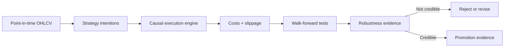
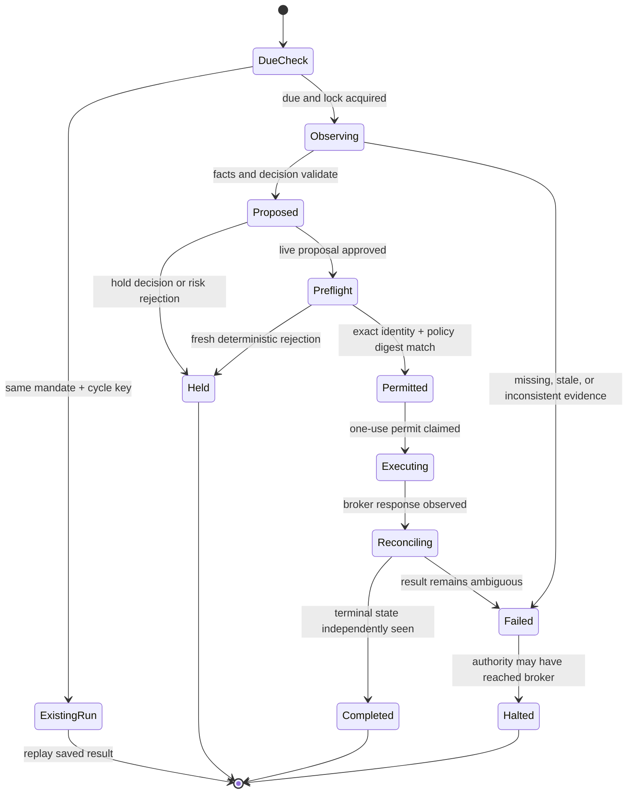
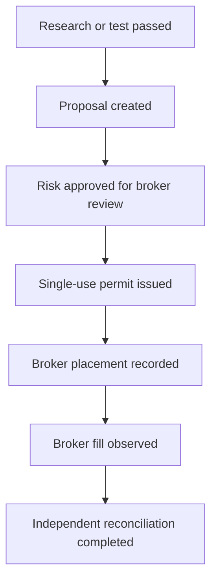

# How Edgecraft works

This guide is the fastest path from “I see a lot of trading code” to a useful mental model of the whole system. It follows the real production path, names the files that own each decision, and walks one illustrative trade from a scheduled wake-up to a reconciled broker result.

If you remember only one sentence, remember this:

> **The model proposes. Typed policy authorizes. The broker executes. Reconciliation proves.**

## The airport analogy

Think of Edgecraft as a small airport built for one carefully constrained aircraft.

| Edgecraft part | Airport equivalent | Job |
|:--|:--|:--|
| `Mandate` | The flight plan | Defines destination, schedule, approved route, and fuel ceiling |
| Codex reasoning agent | The pilot | Reads conditions, compares routes, and recommends fly or stay grounded |
| Market and account observation | Weather + aircraft instruments | Supplies current, timestamped facts |
| Risk policy | Air-traffic control | Applies rules the pilot cannot waive |
| Execution preflight | Final runway inspection | Rechecks the exact aircraft, weather, and route immediately before takeoff |
| Single-use permit | One flight’s takeoff clearance | Authorizes one exact action, once, before expiry |
| Robinhood MCP | The aircraft controls | Is the only path that can touch the brokerage account |
| Audit ledger | Flight recorder | Preserves what the system saw, decided, allowed, attempted, and observed |
| Reconciliation | Arrival confirmation | Independently checks where the aircraft actually ended up |
| Kill switch | Ground stop | Blocks new live departures when state is unsafe or ambiguous |

The pilot is supposed to be creative. Air-traffic control is supposed to be boring. Edgecraft keeps those jobs separate on purpose.

## The system at three altitudes

### 1. The research lab

The research side asks whether an idea deserves any capital at all.

- `data.py` loads synthetic or historical OHLCV data.
- `strategies.py` turns market history into position intentions.
- `engine.py` alone turns those intentions into fills, using the next tradable session rather than same-close hindsight.
- `research.py` runs experiment matrices and cost stress.
- `walkforward.py`, `metrics.py`, and `promotion.py` measure out-of-sample behavior, uncertainty, Deflated Sharpe, and probability of backtest overfitting.



A strong backtest is evidence, not permission. Live authority still belongs to the mandate and the deterministic execution controls.

### 2. The portfolio brain

The autonomous loop asks a narrower question: given the owner’s mandate and current facts, should the system invest now or hold cash?

- `autonomy_models.py` defines the typed `Mandate`, `WeeklyDecision`, evidence inventory, and complete `AgentCyclePayload`.
- `context.py` collects timestamped public web, SEC, and social context.
- `intelligence.py` builds completed-session market and regime diagnostics.
- `codex_runtime.py` asks Codex to observe Robinhood through MCP and return schema-valid facts plus a structured decision.
- `autonomy.py` converts the decision into an idempotent proposal with the remaining cycle budget.

The model may rank opportunities, explain uncertainty, and elect to hold. It may not invent a new symbol, expand the budget, mark stale data fresh, issue itself a permit, or directly bypass policy.

### 3. The control tower

The control plane decides whether an idea may reach the broker.

- `risk.py` evaluates cash, concentration, group exposure, liquidity, spread, turnover, drawdown, market session, data freshness, and research requirements.
- `autonomous_service.py` owns the live state machine and recovery behavior.
- `ledger.py` owns cycle locks, idempotency, permits, broker lifecycle events, unresolved-order detection, and the audit trail.
- `scripts/guard_robinhood_tool.py` is the fail-closed `PreToolUse` boundary around the order-placement tool.
- `observability.py` exposes aggregate health, metrics, and the privacy-safe operator view.

## The full control loop



Two details are easy to miss:

1. **Hold is a successful outcome.** The contribution is a ceiling, not a quota. Preserving cash is correct when evidence is weak or any gate fails.
2. **A proposal is not a trade.** A permit is not a trade. A placement response is not necessarily a fill. Edgecraft reports those proof levels separately.

## One trade, step by step

Assume an illustrative live mandate allows at most one **$2.00 buy** on a market day. The symbol below is `XYZ` on purpose; this walkthrough explains the machinery without publishing a real account position.

### Step 1 — the scheduler wakes the system

The scheduled task runs health and readiness checks, then calls:

```bash
uv run edgecraft cycle \
  --mandate state/mandates/live.json \
  --ledger state/edgecraft.db
```

`cli.py` loads the typed mandate and constructs `AutonomousService`. In `autonomy.py`, `cycle_key()` derives an idempotency key such as `live_mandate:2026-07-21`.

`AuditLedger.cycle_lock()` then acquires a nonblocking filesystem lease. If another worker already owns this cycle, the new attempt reports `in_progress`; it does not start a second reasoning or execution path.

**Invariant:** one mandate and cycle key can have only one active owner.

### Step 2 — the budget is calculated before reasoning

`available_cycle_budget()` reads the mandate ceiling and subtracts any notional already placed in the same budget window.

For this example:

```text
daily ceiling             $2.00
already placed today    - $0.00
remaining cycle budget    $2.00
```

If nothing remains, the cycle completes without asking the model to manufacture activity.

**Invariant:** the contribution is a hard maximum, never a spending target.

### Step 3 — current evidence is collected

`AutonomousService._run_started_cycle()` moves the run to `observing` and assembles four evidence families:

1. The mandate and exact risk policy loaded from disk.
2. Completed-session price and regime data from `intelligence.py`.
3. Timestamped public context from `context.py` when required.
4. Read-only Robinhood account, position, quote, and order-history facts gathered through `CodexRuntime.observe()`.

The runtime must return an `AgentCyclePayload`. Pydantic validates its shapes, money precision, timestamps, symbol uniqueness, and relationship between the stated action and allocations.

`_validate_observation()` then checks deeper facts: the mandate/run identities match, every proposed symbol is in the universe, evaluation quotes exist, cited source IDs are real, no evidence comes from the future, and every invested symbol has quote plus historical and current-context support.

**Invariant:** no free-form prose can quietly become an order.

### Step 4 — the model chooses invest or hold

Suppose the model returns:

```text
action:       invest
symbol:       XYZ
allocation:   100% of this cycle's allowed capital
confidence:   0.78
rationale:    strongest evidence-backed opportunity in the approved universe
alternatives: hold cash; buy another approved candidate
```

That is still only a typed recommendation. The complete decision packet—mandate, policy, evidence inventory, sources, model and prompt versions, alternatives, and uncertainty—is written to the append-only ledger before a side effect.

**Invariant:** persist the decision and its inputs before execution authority exists.

### Step 5 — ordinary Python builds and judges the proposal

`create_weekly_proposal()` in `autonomy.py` converts the typed decision into candidate orders. `evaluate_orders()` in `risk.py` applies the deterministic account, liquidity, exposure, and promotion controls.

For the illustrative order:

```text
side:            buy
symbol:          XYZ
notional:        $2.00
order type:      market or policy-allowed limit
time in force:   policy constrained
```

The risk engine independently checks, among other rules:

- `XYZ` is explicitly allowed and broker-eligible.
- The account has enough settled buying power.
- Notional and order count stay under daily and rolling ceilings.
- The resulting position and symbol-group weights stay below limits.
- The quote is fresh, the spread is acceptable, and liquidity is sufficient.
- The market session is allowed.
- Drawdown and turnover controls pass.
- No unresolved earlier order could cause accidental double spending.
- Required research/promotion evidence exists.

Failure produces a recorded hold/rejection. It does not ask the model to argue with the gate.

**Invariant:** probabilistic confidence can never override deterministic policy.

### Step 6 — the exact order receives a fresh preflight

Markets and accounts change while an agent reasons. Immediately before authority is issued, `CodexRuntime.preflight_order()` performs a read-only Robinhood review for the exact account, symbol, side, notional, order type, time in force, and market-hours choice.

`_validate_preflight()` verifies that every identity matches the proposal. Then `evaluate_orders()` runs again on the fresh account and quote.

Finally, Edgecraft reloads the policy file and compares its SHA-256 digest with the digest stored on the proposal. A mid-cycle policy edit aborts execution.

**Invariant:** approval of a similar order is not approval of this order.

### Step 7 — a one-use permit is issued

Only after both risk passes does `AuditLedger.issue_permit()` create a short-lived token bound to the exact:

```text
run + proposal + order key + account reference
+ symbol + side + dollar notional + order type
+ time in force + market-hours setting
```

The raw token is not stored; the ledger stores its hash and sanitized constraints. The broker guard must atomically claim the token. Missing, expired, reused, mismatched, or unclaimed permits fail closed.

**Invariant:** authority is narrow, expiring, account-bound, and single use.

### Step 8 — Robinhood receives the order

`CodexRuntime.execute_order()` hands the permitted action to Robinhood MCP. The Python process does not keep Robinhood credentials and does not secretly open another broker connection.

The `PreToolUse` guard independently checks the ledger and exact tool arguments before the placement tool can run.

Possible immediate results include `aborted`, `rejected`, `placed`, `partially_filled`, `filled`, or `unknown`. These words are not interchangeable.

**Invariant:** an order API response is evidence about submission, not automatic proof of a fill.

### Step 9 — a separate read proves the outcome

If the broker returns an order identity or an execution-like state, `reconcile_order()` performs an independent read-only broker query. The result must match the permitted run, proposal, order key, symbol, side, and requested notional.

Terminal states are recorded as lifecycle events. A `filled` event includes the observed filled notional, average fill price, fees, and broker identity in the private ledger.

If the placement call errors after authority was issued, `recover_order()` searches the broker’s recent orders rather than blindly retrying. If recovery cannot prove a terminal state, Edgecraft activates the kill switch and leaves the incident unresolved.

**Invariant:** ambiguity after authority is a stop condition, not permission to submit again.

### Step 10 — the cycle closes and performance advances

The run becomes `completed` only after its execution path is safely accounted for. `evaluation.py` advances three cash-flow-matched books:

- the agent’s chosen portfolio;
- the SPY benchmark;
- the mandate’s deterministic strategic-weight baseline.

This avoids comparing a small, periodic contribution strategy with a benchmark that received different cash flows.

The local dashboard, CLI, logs, and metrics all derive their summaries from the same ledger rather than inventing separate truth.

## The evidence ladder

Use this ladder whenever someone asks, “Did the fund trade?”



Only the bottom of the ladder is strong operational proof. Tests, shadow runs, model intentions, approvals, and permits are useful evidence about the software, but none proves money moved.

## What gets saved

`ledger.py` maintains an append-only SQLite history with private file permissions. Important record families include:

| Record | Why it exists |
|:--|:--|
| Mandate | Reconstruct the authority and goal in force |
| Run | Track idempotent cycle state and retries |
| Decision packet | Preserve exact typed inputs, evidence, model metadata, alternatives, and decision |
| Proposal | Preserve orders plus deterministic risk results |
| Runtime event | Explain each state transition and external collection phase |
| Permit | Prove narrow, one-use execution authority |
| Broker event | Track reviewed, placed, filled, rejected, and canceled states |
| Evaluation observation | Compare agent, benchmark, and strategic books over time |

Sensitive account fields are hashed or redacted. Public surfaces use aggregate projections rather than raw ledger payloads.

## Where to read next

Follow this order if you want to learn the implementation without getting lost:

1. `src/edgecraft/autonomy_models.py` — learn the nouns: mandate, decision, evidence, observation.
2. `src/edgecraft/autonomous_service.py` — read `run_cycle()`, `_run_started_cycle()`, then `_execute_one()`.
3. `src/edgecraft/autonomy.py` and `src/edgecraft/risk.py` — see how allocations become orders and why a proposal passes or fails.
4. `src/edgecraft/ledger.py` — inspect locks, runs, permits, events, unresolved orders, and health snapshots.
5. `src/edgecraft/codex_runtime.py` — see the structured prompts and Robinhood MCP boundaries.
6. `scripts/guard_robinhood_tool.py` — inspect the last deterministic gate before placement.
7. `src/edgecraft/evaluation.py` — understand honest, cash-flow-matched measurement.
8. `tests/test_autonomous_service.py` and `tests/test_trade_guard.py` — see the happy path and the dangerous failure paths as executable examples.

Then use the operational guides:

- [Autonomous operations](AUTONOMY.md)
- [Decision data model](DECISION_DATA_MODEL.md)
- [Performance evaluation](PERFORMANCE_EVALUATION.md)
- [Production readiness](PRODUCTION_READINESS.md)

## Final mental model

Edgecraft is not one omnipotent trading agent. It is a chain of narrow components with different jobs:

```text
creative research
    ↓
typed recommendation
    ↓
deterministic risk decision
    ↓
fresh broker preflight
    ↓
single-use authority
    ↓
broker action
    ↓
independent reconciliation
    ↓
append-only proof
```

That separation is the product. It gives the reasoning system room to search for an edge while keeping money movement bounded, inspectable, and recoverable.
